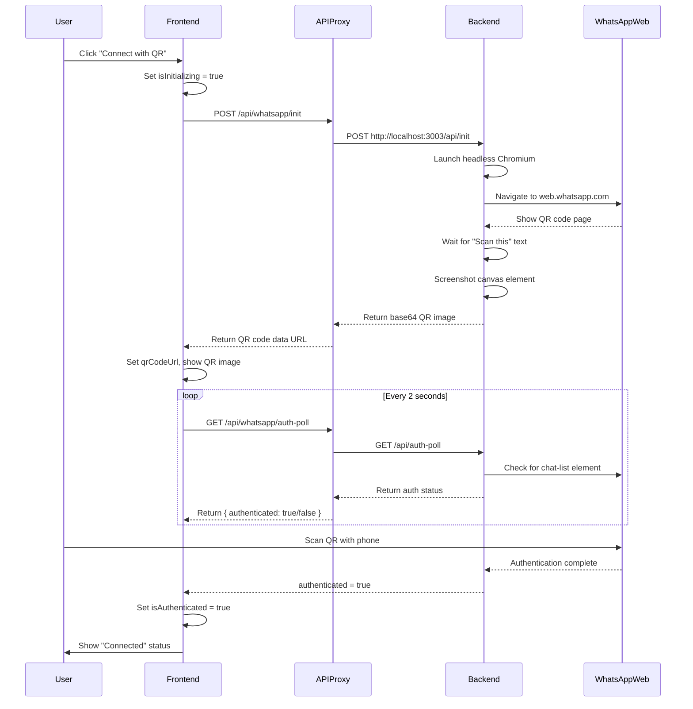
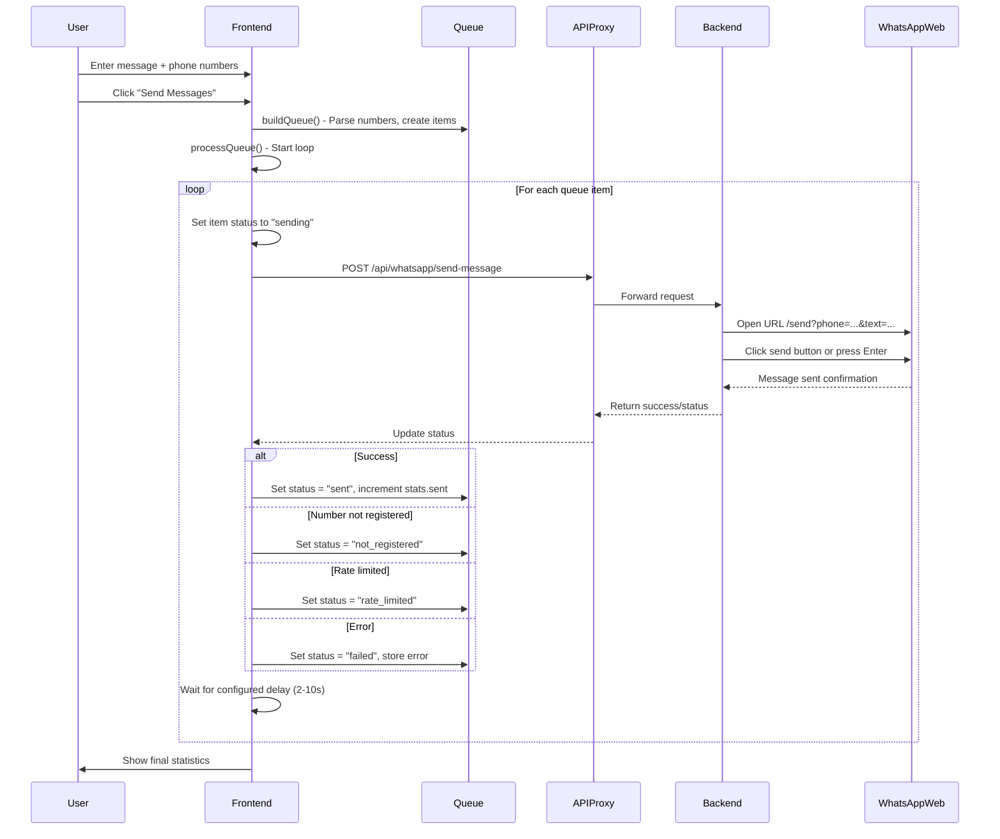

# 🚀 WhatsApp Blaster - AI Agent Guide

> **Comprehensive documentation for AI coding agents to understand, configure, develop, and debug this project.**

---

## 📋 Table of Contents

1. [Project Overview](#project-overview)
2. [Architecture & System Design](#architecture--system-design)
3. [Prerequisites](#prerequisites)
4. [Installation Guide](#installation-guide)
5. [Configuration](#configuration)
6. [Starting the Application](#starting-the-application)
7. [Build Process](#build-process)
8. [Project Structure Explained](#project-structure-explained)
9. [Key Files Reference](#key-files-reference)
10. [API Endpoints Reference](#api-endpoints-reference)
11. [Common Bugs & Fixes](#common-bugs--fixes)
12. [Development Workflow](#development-workflow)
13. [Testing Guide](#testing-guide)
14. [Deployment Guide](#deployment-guide)
15. [Contributing Guidelines](#contributing-guidelines)

---

## 📖 Project Overview

### What is WhatsApp Blaster?

WhatsApp Blaster is a **full-stack web application** for bulk WhatsApp messaging with real WhatsApp Web integration. It provides:

- **Real QR Code Authentication** - Scan actual WhatsApp Web QR codes (not fake/demo)
- **Phone Number Linking** - Alternative auth method via phone number
- **Bulk Message Sending** - Send messages to multiple contacts with configurable delays
- **File Attachments** - Support for images and documents
- **Queue Management** - Real-time status tracking of sent/failed messages
- **Rate Limiting Control** - Configurable delay between messages (2-10 seconds)

### Tech Stack

| Layer | Technology | Version |
|-------|------------|---------|
| **Frontend Framework** | Next.js (App Router) | 16.x |
| **UI Library** | React | 19.x |
| **Language** | TypeScript | 5.x |
| **Styling** | Tailwind CSS | 4.x |
| **UI Components** | shadcn/ui (Radix UI) | Latest |
| **Backend Service** | Express.js | 4.x |
| **Browser Automation** | Playwright | 1.49.x |
| **Database** | SQLite via Prisma ORM | 6.x |
| **Package Manager** | Bun | 1.x |
| **Reverse Proxy** | Caddy (optional) | 2.x |

### Key Features

```
✓ Real WhatsApp Web QR code capture via Playwright
✓ Phone number linking as alternative authentication
✓ Bulk messaging with queue management
✓ File attachment support (images, documents)
✓ Real-time status tracking and statistics
✓ Configurable sending speed (anti-rate-limit)
✓ Responsive UI with dark/light theme support
✓ Standalone build output for Docker deployment
```

---

## 🏗️ Architecture & System Design

### High-Level Architecture

```
┌─────────────────────────────────────────────────────────────────────┐
│                           USER BROWSER                              │
│  ┌───────────────────────────────────────────────────────────────┐  │
│  │                    Next.js Frontend :3000                      │  │
│  │  ┌─────────────────────────────────────────────────────────┐  │  │
│  │  │              React Page (page.tsx)                       │  │  │
│  │  │  • Authentication UI (QR Code / Phone)                   │  │  │
│  │  │  • Message Composer + File Upload                        │  │  │
│  │  │  • Queue Management Table                                │  │  │
│  │  │  • Statistics Dashboard                                   │  │  │
│  │  └─────────────────────────┬───────────────────────────────┘  │  │
│  │                            │                                  │  │
│  │  ┌─────────────────────────▼───────────────────────────────┐  │  │
│  │  │         API Proxy Route (/api/whatsapp/[...path])        │  │  │
│  │  └─────────────────────────┬───────────────────────────────┘  │  │
│  └────────────────────────────┼──────────────────────────────────┘  │
└───────────────────────────────┼─────────────────────────────────────┘
                                │
                    ┌───────────▼───────────┐
                    │    Caddy (Optional)   │
                    │    Reverse Proxy :81  │
                    └───────────┬───────────┘
                                │
┌───────────────────────────────▼─────────────────────────────────────┐
│                  BACKEND SERVICE (Express) :3003                     │
│  ┌─────────────────────────────────────────────────────────────────┐ │
│  │              Express Server (index.ts)                          │ │
│  │  ┌───────────────────────────────────────────────────────────┐  │ │
│  │  │              Playwright Browser Automation                │  │ │
│  │  │  ┌─────────────────────────────────────────────────────┐  │  │ │
│  │  │  │          Headless Chromium Browser                   │  │  │ │
│  │  │  │  • Navigates to web.whatsapp.com                    │  │  │ │
│  │  │  │  • Captures QR code from canvas element             │  │  │ │
│  │  │  │  • Sends messages via URL + click/enter             │  │  │ │
│  │  │  │  • Detects authentication status changes            │  │  │ │
│  │  │  └─────────────────────────────────────────────────────┘  │  │ │
│  │  └───────────────────────────────────────────────────────────┘  │ │
│  └─────────────────────────────────────────────────────────────────┘ │
│                                                                      │
│  ┌────────────────────┐  ┌────────────────────────────────────────┐ │
│  │   SQLite Database  │  │        In-Memory State                 │ │
│  │   (Prisma ORM)     │  │  • isAuthenticated: boolean           │ │
│  │   • User model     │  │  • qrCodeData: string | null          │ │
│  │   • Post model     │  │  • messageStatuses: Map               │ │
│  └────────────────────┘  │  • browser/page references            │ │
│                           └────────────────────────────────────────┘ │
└──────────────────────────────────────────────────────────────────────┘
```

### Data Flow Diagrams

#### Authentication Flow (QR Code)



#### Message Sending Flow



### Port Configuration

| Service | Port | Protocol | Description |
|---------|------|----------|-------------|
| Next.js Dev Server | 3000 | HTTP | Frontend application |
| WhatsApp Backend Service | 3003 | HTTP | Express + Playwright service |
| Caddy Reverse Proxy | 81 | HTTP | Optional production proxy |

### State Management

The application uses a hybrid state management approach:

**Frontend State (React useState):**
- `isAuthenticated` - WhatsApp connection status
- `qrCodeUrl` - Base64 QR code image
- `isInitializing` - Loading state during init
- `queue[]` - Message queue items
- `message`, `phoneNumbers`, `files` - Form inputs
- `stats` - Sending statistics

**Backend State (In-Memory):**
- `browser` - Playwright Browser instance
- `page` - Playwright Page instance
- `isAuthenticated` - Auth status flag
- `qrCodeData` - Cached QR code base64
- `messageStatuses` - Map of message ID to status

⚠️ **Important:** Backend state is NOT persistent. Restarting the backend service loses all state including authentication.

---

## 📦 Prerequisites

### Required Software

| Software | Minimum Version | Purpose |
|----------|----------------|---------|
| **Bun** | 1.0+ | Package manager and runtime |
| **Node.js** | 18+ | Alternative runtime (if not using Bun) |
| **Chromium/Chrome** | Latest | For Playwright browser automation |
| **Git** | Any | Version control |

### System Requirements

- **OS**: Linux (Ubuntu 20.04+, Debian 11+), macOS 12+, Windows 10+ (WSL2 recommended)
- **RAM**: Minimum 2GB (4GB recommended for browser automation)
- **Disk**: 500MB+ for dependencies
- **Network**: Internet access for npm/bun packages and WhatsApp Web

### Before You Begin

```bash
# Check Bun installation
bun --version  # Should be 1.0 or higher

# If Bun is not installed:
curl -fsSL https://bun.sh/install | bash

# Install Playwright browsers (required for WhatsApp automation)
npx playwright install chromium

# Or install all browsers:
npx playwright install
```

---

## 🔧 Installation Guide

### Step 1: Clone or Copy Project

```bash
# If using git
git clone <repository-url>
cd whatsapp-blaster

# Or copy the project directory
cp -r /path/to/project ./whatsapp-blaster
cd whatsapp-blaster
```

### Step 2: Install Root Dependencies

```bash
# Install Next.js frontend dependencies
bun install

# This installs:
# - Next.js 16, React 19, TypeScript 5
# - Tailwind CSS 4, shadcn/ui components
# - Prisma ORM, Zustand state management
# - All Radix UI primitives
```

### Step 3: Install Backend Service Dependencies

```bash
# Navigate to the WhatsApp service directory
cd mini-services/whatsapp-service

# Install backend dependencies
bun install

# This installs:
# - Express.js 4.x (HTTP server)
# - Playwright 1.49.x (browser automation)
# - CORS middleware
# - UUID generation

# Return to project root
cd ../..
```

### Step 4: Setup Database

```bash
# Generate Prisma client from schema
bun run db:generate

# Push schema to SQLite database (creates db/custom.db)
bun run db:push

# Or run migrations (for production)
bun run db:migrate
```

### Step 5: Install Playwright Browsers

```bash
# Install Chromium for WhatsApp Web automation
npx playwright install chromium

# Verify installation
npx playwright install --dry-run
```

### Step 6: Verify Installation

```bash
# Test that all dependencies are installed correctly
bun run dev &
sleep 5
curl -s http://localhost:3000/api | grep -q "Hello" && echo "✓ Frontend OK" || echo "✗ Frontend failed"

# Kill the test server
pkill -f "next dev" 2>/dev/null || true
```

---

## ⚙️ Configuration

### Environment Variables

Create a `.env` file in the project root (already exists):

```env
# Database Configuration
DATABASE_URL=file:./db/custom.db

# Optional: Backend Service Port (default: 3003)
WHATSAPP_SERVICE_PORT=3003

# Optional: Next.js Port (default: 3000)
PORT=3000

# Optional: Node Environment
NODE_ENV=development
```

### Next.js Configuration (`next.config.ts`)

```typescript
import type { NextConfig } from "next";

const nextConfig: NextConfig = {
  output: "standalone",           // Enables Docker-friendly standalone output
  typescript: {
    ignoreBuildErrors: true,      // Relaxed TS checking (adjust for strict mode)
  },
  reactStrictMode: false,         // Disabled to avoid double-render issues with Playwright
};

export default nextConfig;
```

**Configuration Options:**
- `output: "standalone"` - Creates self-contained build for Docker
- `typescript.ignoreBuildErrors` - Set to `false` for stricter type checking
- `reactStrictMode` - Enable for development, may cause issues with browser automation

### Tailwind CSS Configuration

The project uses **Tailwind CSS v4** with CSS variable-based theming:

```typescript
// tailwind.config.ts
const config: Config = {
  darkMode: "class",              // Enable class-based dark mode
  content: ["./pages/**/*.{js,ts,jsx,tsx,mdx}", "./components/**/*.{js,ts,jsx,tsx,mdx}", "./app/**/*.{js,ts,jsx,tsx,mdx}"],
  plugins: [tailwindcssAnimate],  // Animation plugin
};
```

### Caddy Configuration (Optional Reverse Proxy)

For production deployments behind Caddy on port 81:

```
# Caddyfile
:81 {
    @transform_port_query {
        query XTransformPort=*
    }

    handle @transform_port_query {
        reverse_proxy localhost:{query.XTransformPort} {
            header_up Host {host}
            header_up X-Forwarded-For {remote_host}
            header_up X-Forwarded-Proto {scheme}
            header_up X-Real-IP {remote_host}
        }
    }

    handle {
        reverse_proxy localhost:3000 {
            header_up Host {host}
            header_up X-Forwarded-For {remote_host}
            header_up X-Forwarded-Proto {scheme}
            header_up X-Real-IP {remote_host}
        }
    }
}
```

### Prisma Schema (`prisma/schema.prisma`)

```prisma
generator client {
  provider = "prisma-client-js"
}

datasource db {
  provider = "sqlite"
  url      = env("DATABASE_URL")
}

model User {
  id        String   @id @default(uuid())
  email     String   @unique
  name      String?
  createdAt DateTime @default(now())
  posts     Post[]
}

model Post {
  id        String   @id @default(uuid())
  title     String
  content   String?
  published Boolean  @default(false)
  authorId  String
  author    User     @relation(fields: [authorId], references: [id])
  createdAt DateTime @default(now())
}
```

---

## 🚀 Starting the Application

### Development Mode (Recommended for AI Agents)

#### Terminal 1: Start Backend Service

```bash
# Navigate to WhatsApp service directory
cd mini-services/whatsapp-service

# Start with hot reload (recommended for development)
bun run dev

# Or start without hot reload
bun run start

# Expected output:
# ╔══════════════════════════════════════════════════╗
# ║                                                  ║
# ║   🚀  WhatsApp Blaster Service (Live Mode)      ║
# ║                                                  ║
# ║   Running: http://localhost:3003                 ║
# ║   Mode:     Live (Real WhatsApp Web)             ║
# ║                                                  ║
# ╚══════════════════════════════════════════════════╝
```

#### Terminal 2: Start Frontend

```bash
# From project root
cd /home/z/my-project  # or your project directory

# Start Next.js dev server
bun run dev

# Expected output:
# > nextjs_tailwind_shadcn_ts@0.2.1 dev
# > next dev -p 3000
# 
#   ▲ Next.js 16.1.1
#   - Local:        http://localhost:3000
#   - Environments: .env.local (.env)
```

#### Access the Application

Open your browser to: **http://localhost:3000**

### Production Mode

```bash
# Step 1: Build the application
bun run build

# Step 2: Start backend service (in background)
cd mini-services/whatsapp-service && nohup bun run start > service.log 2>&1 &

# Step 3: Start production server
cd ../..
bun run start

# Or use the standalone server directly
NODE_ENV=production bun .next/standalone/server.js
```

### Starting with Caddy (Production)

```bash
# Start Caddy reverse proxy
caddy start --config Caddyfile

# Access via: http://localhost:81
```

### Quick Start Script

Create `start-dev.sh` for easy development:

```bash
#!/bin/bash
# start-dev.sh - Quick development startup script

set -e

echo "🚀 Starting WhatsApp Blaster in Development Mode..."
echo ""

# Check if backend is already running
if curl -s http://localhost:3003/api/health > /dev/null 2>&1; then
    echo "✓ Backend service already running on :3003"
else
    echo "Starting backend service..."
    cd mini-services/whatsapp-service
    nohup bun run dev > ../backend.log 2>&1 &
    cd ../..
    sleep 3
    echo "✓ Backend service started on :3003"
fi

# Start frontend
echo "Starting frontend server..."
bun run dev

# To stop: pkill -f "next dev" && pkill -f "whatsapp-service"
```

---

## 📦 Build Process

### Building for Production

```bash
# Clean any previous builds
rm -rf .next

# Run production build
bun run build

# Build output structure:
# .next/
# ├── standalone/           # Self-contained server
# │   ├── .next/static/     # Static assets (copied during build)
# │   ├── public/           # Public files (copied during build)
# │   └── server.js         # Entry point
# └── static/               # Original static assets
```

### Build Script Details

From `package.json`:

```json
{
  "scripts": {
    "build": "next build && cp -r .next/static .next/standalone/.next/ && cp -r public .next/standalone/",
    "start": "NODE_ENV=production bun .next/standalone/server.js 2>&1 | tee server.log"
  }
}
```

**What the build does:**
1. `next build` - Compiles TypeScript, generates optimized bundles
2. Creates `.next/standalone/` directory with all dependencies
3. Copies static assets to standalone directory
4. Copies public files to standalone directory

### Docker Build

Create `Dockerfile`:

```dockerfile
FROM node:18-alpine AS base

# Install dependencies for Chromium
RUN apk add --no-cache chromium \
    nss \
    freetype \
    freetype-dev \
    harfbuzz \
    ca-certificates \
    ttf-freefont

# Install Playwright browsers
RUN npx playwright install chromium --with-deps

WORKDIR /app

# Copy package files
FROM base AS deps
COPY package.json bun.lock ./
RUN corepack enable && bun install --frozen-lockfile

# Copy backend service
FROM base AS backend-deps
WORKDIR /app/mini-services/whatsapp-service
COPY mini-services/whatsapp-service/package.json ./
RUN corepack enable && bun install --frozen-lockfile

# Build the application
FROM base AS builder
WORKDIR /app
COPY --from=deps /app/node_modules ./node_modules
COPY . .
RUN corepack enable && bun run build

# Production image
FROM base AS runner
WORKDIR /app

ENV NODE_ENV=production

COPY --from=builder /app/.next/standalone ./
COPY --from=builder /app/.next/static ./.next/static
COPY --from=builder /app/public ./public

EXPOSE 3000

CMD ["bun", "server.js"]
```

Build and run:

```bash
docker build -t whatsapp-blaster .
docker run -p 3000:3000 --shm-size=2gb whatsapp-blaster
```

---

## 📁 Project Structure Explained

```
whatsapp-blaster/
│
├── 📄 CONFIGURATION FILES
│   ├── package.json           # Root dependencies and scripts (Next.js app)
│   ├── next.config.ts         # Next.js configuration (standalone output)
│   ├── tsconfig.json          # TypeScript compiler options
│   ├── tailwind.config.ts     # Tailwind CSS v4 configuration
│   ├── postcss.config.mjs     # PostCSS configuration
│   ├── components.json        # shadcn/ui component configuration
│   ├── eslint.config.mjs      # ESLint rules
│   ├── Caddyfile              # Reverse proxy config (port 81)
│   └── .env                   # Environment variables
│
├── 📁 src/                    # Source code (Next.js App Router)
│   ├── app/
│   │   ├── layout.tsx         # Root layout (fonts, metadata, Toaster)
│   │   ├── page.tsx           # MAIN PAGE - WhatsApp Blaster UI (~1390 lines)
│   │   ├── globals.css        # Global styles + CSS variables (theme)
│   │   └── api/
│   │       ├── route.ts       # Health endpoint (/api -> "Hello world")
│   │       └── whatsapp/
│   │           └── [...path]/
│   │               └── route.ts  # API PROXY → forwards to :3003
│   │
│   ├── components/
│   │   └── ui/                # 50+ shadcn/ui components (Radix-based)
│   │       ├── button.tsx
│   │       ├── card.tsx
│   │       ├── input.tsx
│   │       ├── select.tsx     # ← Use this for country code dropdown
│   │       ├── dialog.tsx
│   │       ├── table.tsx
│   │       └── ... (50+ more)
│   │
│   ├── hooks/
│   │   ├── use-mobile.ts      # Mobile detection hook
│   │   └── use-toast.ts       # Toast notification hook
│   │
│   └── lib/
│       ├── db.ts              # Prisma client singleton
│       └── utils.ts           # Utility functions (cn() classnames)
│
├── 📁 mini-services/          # Microservices
│   └── whatsapp-service/      # BACKEND SERVICE (Express + Playwright)
│       ├── index.ts           # MAIN SERVICE FILE (~901 lines)
│       ├── server.cjs         # Mock/simulation server for testing
│       ├── test-server.cjs    # Test server variant
│       ├── package.json       # Service dependencies
│       └── package-lock.json  # npm lockfile
│
├── 📁 prisma/
│   └── schema.prisma          # Database schema (SQLite)
│
├── 📁 db/
│   └── custom.db              # SQLite database file
│
├── 📁 public/
│   ├── logo.svg               # Application logo
│   └── robots.txt             # SEO robots file
│
├── 📁 download/               # Generated assets (screenshots, QR codes)
│
├── 📁 examples/
│   └── websocket/             # WebSocket example code
│
└── 📁 tests/                  # Runtime test scripts
```

---

## 📝 Key Files Reference

### 1. Main Page (`src/app/page.tsx`)

**Purpose:** Primary UI component for the entire application

**Size:** ~1390 lines

**Key Sections:**

```typescript
// === TYPES ===
interface UploadedFile {
  id: string;
  name: string;
  size: string;
  type: 'image' | 'document';
  preview?: string;
  file: File;
  dataUrl?: string;  // Base64 encoded for sending
}

interface QueueItem {
  id: string;
  phoneNumber: string;
  message: string;
  files: UploadedFile[];
  status: 'pending' | 'sending' | 'sent' | 'failed' | 'not_registered' | 'rate_limited';
  error?: string;
  timestamp: Date;
}

// === STATE VARIABLES ===
// Authentication
const [isAuthenticated, setIsAuthenticated] = useState(false)
const [isInitializing, setIsInitializing] = useState(false)
const [qrCodeUrl, setQrCodeUrl] = useState<string | null>(null)
const [authMethod, setAuthMethod] = useState<'qr' | 'phone' | null>(null)

// Form inputs
const [message, setMessage] = useState('')
const [phoneNumbers, setPhoneNumbers] = useState('')
const [files, setFiles] = useState<UploadedFile[]>([])
const [speed, setSpeed] = useState([5])  // Delay in seconds

// Queue management
const [queue, setQueue] = useState<QueueItem[]>([])
const [isSending, setIsSending] = useState(false)
const [isPaused, setIsPaused] = useState(false)
const [currentProgress, setCurrentProgress] = useState(0)
const [stats, setStats] = useState({ total: 0, sent: 0, failed: 0, notRegistered: 0 })

// === API SERVICE LAYER ===
const API_BASE = '/api/whatsapp'

const whatsappAPI = {
  init: async () => {
    const res = await fetch(`${API_BASE}/init`, { method: 'POST' })
    return res.json()
  },
  
  getQRCode: async () => {
    const res = await fetch(`${API_BASE}/qrcode`)
    const blob = await res.blob()
    return URL.createObjectURL(blob)
  },
  
  // ... other methods
}

// === KEY FUNCTIONS ===
async function initializeWhatsApp() { /* Initiates QR flow */ }
async function initializeWithPhone() { /* Phone linking flow */ }
async function refreshQR() { /* Refresh expired QR */ }
function buildQueue() { /* Parse phone numbers into queue */ }
async function processQueue() { /* Main send loop */ }
function startAuthPolling() { /* Poll for auth completion */ }
```

**UI Components Used:**
- `Card`, `CardHeader`, `CardContent` - Section containers
- `Button` - Actions (connect, send, pause)
- `Input`, `Textarea` - Form inputs
- `Table`, `TableRow`, `TableCell` - Queue display
- `Badge` - Status indicators
- `Progress` - Sending progress bar
- `Select`, `SelectItem` - Dropdowns (use for country codes!)
- `Tabs` - Tab navigation
- `Dialog`, `DialogContent` - Modals
- `Toast`, `Toaster` - Notifications

### 2. API Proxy Route (`src/app/api/whatsapp/[...path]/route.ts`)

**Purpose:** Forwards all WhatsApp API calls from frontend (:3000) to backend (:3003)

**Key Implementation:**

```typescript
import { NextRequest, NextResponse } from 'next/server'

const BACKEND_URL = 'http://localhost:3003'

export async function GET(request: NextRequest, { params }: { params: Promise<{ path: string[] }> }) {
  const { path } = await params
  const urlPath = path.join('/')
  const targetUrl = `${BACKEND_URL}/api/${urlPath}`
  
  try {
    const response = await fetch(targetUrl, {
      method: 'GET',
      headers: { 'Content-Type': 'application/json' }
    })
    
    // Handle image responses (QR codes)
    const contentType = response.headers.get('content-type')
    if (contentType?.includes('image')) {
      const imageBuffer = await response.arrayBuffer()
      return new NextResponse(imageBuffer, {
        status: response.status,
        headers: { 'Content-Type': contentType }
      })
    }
    
    const data = await response.json()
    return NextResponse.json(data, { status: response.status })
  } catch (error) {
    return NextResponse.json(
      { error: 'WhatsApp service unavailable', details: error.message },
      { status: 503 }
    )
  }
}

// Similar pattern for POST requests...
```

**Important Notes:**
- Must have backend running on port 3003
- Returns 503 if backend is unavailable
- Handles both JSON and image/blob responses
- Preserves content-type headers for QR code images

### 3. Backend Service (`mini-services/whatsapp-service/index.ts`)

**Purpose:** Express server with Playwright browser automation for WhatsApp Web

**Size:** ~901 lines

**Core Components:**

```typescript
// === IMPORTS ===
import express from 'express'
import { chromium } from 'playwright'
import cors from 'cors'
import { v4 as uuidv4 } from 'uuid'

// === GLOBAL STATE ===
let browser: Browser | null = null
let page: Page | null = null
let isAuthenticated = false
let qrCodeData: string | null = null
let isInitializing = false
const messageStatuses = new Map<string, MessageStatus>()

// === BROWSER MANAGEMENT ===
async function getBrowser(): Promise<Browser> {
  if (!browser || !browser.isConnected()) {
    browser = await chromium.launch({
      headless: true,
      args: ['--no-sandbox', '--disable-setuid-sandbox']
    })
  }
  return browser
}

// === QR CODE CAPTURE ===
async function waitForQRCode(page: Page, timeout: number = 60000): Promise<string | null> {
  // Strategy 1: Wait for "Scan this" text, screenshot canvas
  await page.waitForSelector('text=Scan this', { timeout: 15000 })
  const canvasElement = await page.$('canvas')
  if (canvasElement) {
    const screenshotBuffer = await canvasElement.screenshot({ type: 'png' })
    const base64Data = screenshotBuffer.toString('base64')
    // Validate it's a real QR (>5000 bytes)
    if (base64Data.length > 5000) {
      return `data:image/png;base64,${base64Data}`
    }
  }
  // Fallback strategies...
}

// === AUTHENTICATION CHECK ===
async function checkAuthenticationStatus(page: Page): Promise<boolean> {
  try {
    // Look for elements that only appear when authenticated
    const chatList = await page.$('[data-testid="chat-list"]')
    const conversationPanel = await page.$('[data-testid="conversation-panel-wrapper"]')
    return !!(chatList || conversationPanel)
  } catch {
    return false
  }
}

// === MESSAGE SENDING ===
async function sendMessageToWhatsApp(phoneNumber, message, file?, messageId?) {
  const encodedMessage = encodeURIComponent(message)
  const url = `https://web.whatsapp.com/send?phone=${phoneNumber}&text=${encodedMessage}`
  
  await page.goto(url, { waitUntil: 'domcontentloaded', timeout: 30000 })
  await page.waitForTimeout(2000)  // Wait for chat to load
  
  // Try clicking send button first
  const sendButton = await page.querySelector('[data-icon="send"]')
  if (sendButton) {
    await sendButton.click()
  } else {
    // Fallback: Press Enter
    await page.keyboard.press('Enter')
  }
}
```

**API Endpoints Implemented:**

| Method | Endpoint | Handler Function | Description |
|--------|----------|------------------|-------------|
| GET | `/api/health` | - | Health check with status |
| POST | `/api/init` | `handleInit()` | Initialize, launch browser, capture QR |
| POST | `/api/init-phone` | `handleInitPhone()` | Initialize with phone linking |
| GET | `/api/qrcode` | `handleGetQRCode()` | Get current QR code image |
| POST | `/api/refresh-qr` | `handleRefreshQR()` | Refresh expired QR code |
| GET | `/api/status` | `handleGetStatus()` | Get auth status |
| GET | `/api/auth-poll` | `handleAuthPoll()` | Poll for QR scan completion |
| POST | `/api/send-message` | `handleSendMessage()` | Send single message |
| POST | `/api/bulk-send` | `handleBulkSend()` | Send multiple messages |
| GET | `/api/message-status/:id` | `handleGetMessageStatus()` | Get message status |
| GET | `/api/bulk-status/:jobId` | `handleGetBulkStatus()` | Get job status summary |
| POST | `/api/logout` | `handleLogout()` | Disconnect and cleanup |

---

## 🔌 API Endpoints Reference

### Authentication Endpoints

#### POST `/api/whatsapp/init`
Initialize WhatsApp connection and generate QR code.

**Request:**
```json
{}
```

**Response (Success):**
```json
{
  "success": true,
  "message": "WhatsApp initialization started",
  "mode": "live",
  "qrcodeAvailable": true
}
```

**Then call GET `/api/whatsapp/qrcode` to get the actual QR image.**

#### GET `/api/whatsapp/qrcode`
Get the QR code image.

**Response:**
- Content-Type: `image/png`
- Body: Binary PNG image data

**Usage in Frontend:**
```typescript
const response = await fetch('/api/whatsapp/qrcode')
const blob = await response.blob()
const qrCodeUrl = URL.createObjectURL(blob)
setQrCodeUrl(qrCodeUrl)
```

#### POST `/api/whatsapp/refresh-qr`
Refresh an expired QR code.

**Request:**
```json
{}
```

**Response:**
```json
{
  "success": true,
  "message": "QR code refreshed successfully",
  "qrcodeAvailable": true
}
```

#### GET `/api/whatsapp/auth-poll`
Poll for authentication status (call every 2 seconds).

**Response (Not Authenticated):**
```json
{
  "authenticated": false,
  "status": "waiting_for_scan"
}
```

**Response (Authenticated):**
```json
{
  "authenticated": true,
  "status": "authenticated",
  "phoneNumber": "+1234567890"
}
```

#### POST `/api/whatsapp/init-phone`
Initialize with phone number linking.

**Request:**
```json
{
  "phoneNumber": "+1234567890"
}
```

**Response:**
```json
{
  "success": true,
  "message": "Phone linking initiated",
  "method": "phone"
}
```

### Messaging Endpoints

#### POST `/api/whatsapp/send-message`
Send a single message.

**Request:**
```json
{
  "phoneNumber": "+1234567890",
  "message": "Hello from WhatsApp Blaster!",
  "messageId": "msg_123456"
}
```

**Response (Success):**
```json
{
  "success": true,
  "messageId": "msg_123456",
  "status": "sent",
  "timestamp": "2024-01-15T10:30:00Z"
}
```

**Response (Error - Not Registered):**
```json
{
  "success": false,
  "error": "Phone number not registered on WhatsApp",
  "status": "not_registered"
}
```

#### POST `/api/whatsapp/bulk-send`
Send multiple messages with delay.

**Request:**
```json
{
  "messages": [
    { "phoneNumber": "+1234567890", "message": "Hello!" },
    { "phoneNumber": "+0987654321", "message": "Hi there!" }
  ],
  "delayMs": 5000
}
```

**Response:**
```json
{
  "success": true,
  "jobId": "job_abc123",
  "totalMessages": 2,
  "status": "processing"
}
```

#### GET `/api/whatsapp/message-status/:id`
Get status of a specific message.

**Response:**
```json
{
  "messageId": "msg_123456",
  "status": "sent",
  "timestamp": "2024-01-15T10:30:00Z",
  "error": null
}
```

### Status Endpoints

#### GET `/api/whatsapp/status`
Get current authentication and connection status.

**Response:**
```json
{
  "isAuthenticated": true,
  "isInitialized": true,
  "hasQRCode": false,
  "mode": "live",
  "uptime": 3600
}
```

#### GET `/api/health`
Health check endpoint.

**Response:**
```json
{
  "status": "ok",
  "service": "WhatsApp Blaster Service",
  "version": "1.0.0",
  "mode": "live",
  "isAuthenticated": false,
  "browserConnected": true,
  "uptime": 120
}
```

#### POST `/api/whatsapp/logout`
Disconnect and clean up resources.

**Response:**
```json
{
  "success": true,
  "message": "Logged out successfully"
}
```

---

## 🐛 Common Bugs & Fixes

This section documents known issues and their solutions to help AI agents quickly diagnose and fix problems.

### Bug #1: QR Code Not Appearing in Browser UI

**Symptoms:**
- Backend works (QR generated via direct curl/Python test)
- Frontend shows loading spinner but no QR code image
- Browser console may show errors

**Root Causes & Fixes:**

#### Cause A: Backend Service Not Running
```bash
# Check if backend is running
curl http://localhost:3003/api/health

# If not running, start it:
cd mini-services/whatsapp-service
bun run dev
```

#### Cause B: API Proxy Issue
The Next.js API proxy might not be forwarding correctly.

**Check the proxy route** (`src/app/api/whatsapp/[...path]/route.ts`):
```typescript
// Ensure BACKEND_URL is correct
const BACKEND_URL = 'http://localhost:3003'  // Must match backend port

// Add logging for debugging
console.log('[Proxy] Forwarding to:', targetUrl)
console.log('[Proxy] Response status:', response.status)
```

#### Cause C: CORS or Network Issues
```typescript
// In backend (mini-services/whatsapp-service/index.ts):
app.use(cors())  // Ensure CORS is enabled

// In frontend, check browser console for CORS errors
```

#### Cause D: Image Response Handling
The QR code endpoint returns an image, not JSON.

**Fix in frontend:**
```typescript
// WRONG: Trying to parse image as JSON
const data = await res.json()  // ❌ Will fail

// CORRECT: Handle as blob
const blob = await res.blob()
const imageUrl = URL.createObjectURL(blob)  // ✅ Correct
setQrCodeUrl(imageUrl)
```

#### Cause E: Timing Issue - QR Not Ready Yet
The QR code might not be ready immediately after `POST /init`.

**Fix: Add retry logic:**
```typescript
async function fetchQRWithRetry(maxRetries = 5, delay = 2000) {
  for (let i = 0; i < maxRetries; i++) {
    try {
      const response = await fetch(`${API_BASE}/qrcode`)
      if (response.ok) {
        const blob = await response.blob()
        if (blob.size > 1000) {  // Valid image size
          return URL.createObjectURL(blob)
        }
      }
    } catch (error) {
      console.error(`QR fetch attempt ${i + 1} failed:`, error)
    }
    await new Promise(resolve => setTimeout(resolve, delay))
  }
  throw new Error('Failed to fetch QR code after retries')
}
```

---

### Bug #2: Fake/Demo QR Code Instead of Real One

**Symptoms:**
- QR code appears but is decorative/not scannable
- QR code looks like an SVG graphic, not a real WhatsApp QR

**Root Cause:** Old code was generating demo/fake QR codes instead of using Playwright.

**Fix:** Ensure backend uses real WhatsApp Web automation:

```typescript
// In mini-services/whatsapp-service/index.ts

// ✅ CORRECT: Real QR capture via Playwright
async function waitForQRCode(page: Page, timeout: number = 60000): Promise<string | null> {
  await page.waitForSelector('text=Scan this', { timeout: 15000 })
  const canvasElement = await page.$('canvas')
  if (canvasElement) {
    const screenshotBuffer = await canvasElement.screenshot({ type: 'png' })
    const base64Data = screenshotBuffer.toString('base64')
    
    // Validate it's a real QR (should be >5000 bytes for real QR)
    if (base64Data.length > 5000) {
      return `data:image/png;base64,${base64Data}`
    }
  }
  return null
}

// ❌ WRONG: Fake/demo QR generation
function generateFakeQR() {
  return `<svg>...</svg>`  // Don't do this!
}
```

---

### Bug #3: Backend Service Crashes After Init

**Symptoms:**
- Service starts fine
- Works for one request then dies
- Error: `unhandledRejection` or `uncaughtException`

**Fix: Add Global Error Handlers**

Add these to `mini-services/whatsapp-service/index.ts` at the bottom:

```typescript
// Global error handlers to prevent crashes
process.on('unhandledRejection', (reason, promise) => {
  console.error('Unhandled Rejection at:', promise, 'reason:', reason)
  // Don't exit - log and continue
})

process.on('uncaughtException', (error) => {
  console.error('Uncaught Exception:', error)
  // Log but don't crash
})

// Server error handler
server.on('error', (error: NodeJS.ErrnoException) => {
  if (error.code === 'EADDRINUSE') {
    console.error(`Port ${PORT} is already in use`)
  } else {
    console.error('Server error:', error)
  }
})
```

**Also ensure graceful shutdown:**

```typescript
async function gracefulShutdown() {
  console.log('Starting graceful shutdown...')
  await closeBrowser()
  server.close(() => {
    console.log('Server closed')
    process.exit(0)
  })
}

process.on('SIGINT', gracefulShutdown)
process.on('SIGTERM', gracefulShutdown)
```

---

### Bug #4: "Port Already in Use" Error

**Symptoms:**
```
Error: listen EADDRINUSE :::3000
Error: listen EADDRINUSE :::3003
```

**Fix:**

```bash
# Find process using the port
lsof -i :3000
lsof -i :3003

# Kill the process
kill -9 <PID>

# Or kill all node/bun processes
pkill -f "next dev"
pkill -f "whatsapp-service"

# Verify port is free
lsof -i :3000  # Should return nothing
```

---

### Bug #5: Playwright/Chromium Not Found

**Symptoms:**
```
Error: Executable doesn't exist: chromium
Error: Can't find Chromium binary
```

**Fix:**

```bash
# Install Playwright browsers
npx playwright install chromium

# Install with system dependencies (for Linux)
npx playwright install-deps chromium

# Verify installation
npx playwright install --dry-run
```

**If still failing, specify executable path:**

```typescript
const browser = await chromium.launch({
  executablePath: '/usr/bin/chromium-browser',  // or '/usr/bin/google-chrome'
  headless: true,
  args: ['--no-sandbox', '--disable-setuid-sandbox']
})
```

---

### Bug #6: WhatsApp Web Loading Forever / Timeout

**Symptoms:**
- QR code capture times out
- `waitForSelector('text=Scan this')` fails
- Page shows loading spinner indefinitely

**Causes & Fixes:**

#### Cause A: Network Issues
```typescript
// Increase timeouts
await page.goto('https://web.whatsapp.com', {
  waitUntil: 'networkidle',
  timeout: 60000  // 60 seconds
})

// Wait longer for QR
await page.waitForSelector('text=Scan this', { timeout: 30000 })
```

#### Cause B: Headless Detection
WhatsApp might detect headless browser.

**Fix:**
```typescript
const browser = await chromium.launch({
  headless: true,
  args: [
    '--no-sandbox',
    '--disable-setuid-sandbox',
    '--disable-blink-features=AutomationControlled',
    '--disable-infobars',
    '--window-size=1920,1080'
  ]
})

// Remove webdriver property
await page.evaluate(() => {
  Object.defineProperty(navigator, 'webdriver', { get: () => undefined })
})
```

#### Cause C: Region Blocking
Some regions block WhatsApp Web.

**Fix:** Use proxy or VPN:
```typescript
const browser = await chromium.launch({
  proxy: { server: 'http://proxy.example.com:8080' }
})
```

---

### Bug #7: Messages Not Sending / "Element Not Found"

**Symptoms:**
- Authentication works
- Messages fail with "Send button not found"
- Timeout errors when sending

**Fix: Improve Element Selectors**

```typescript
async function sendMessageToWhatsApp(phoneNumber, message, file?, messageId?) {
  const url = `https://web.whatsapp.com/send?phone=${phoneNumber}&text=${encodeURIComponent(message)}`
  
  await page.goto(url, { waitUntil: 'domcontentloaded', timeout: 30000 })
  
  // Wait for chat input to be ready - multiple strategies
  try {
    // Strategy 1: Wait for send button
    await page.waitForSelector('[data-icon="send"]', { timeout: 10000 })
    const sendButton = await page.querySelector('[data-icon="send"]')
    if (sendButton) {
      await sendButton.click()
      return { success: true }
    }
  } catch (e) {
    console.log('Send button not found, trying Enter key')
  }
  
  // Strategy 2: Focus input and press Enter
  const selector = 'div[contenteditable="true"][data-tab="10"]'
  await page.click(selector)
  await page.keyboard.press('Enter')
  
  return { success: true }
}
```

---

### Bug #8: Memory Leaks / Browser Instances Piling Up

**Symptoms:**
- System slows down over time
- Multiple Chrome processes
- RAM usage keeps increasing

**Fix: Proper Resource Cleanup**

```typescript
// Always close browser on logout/error
async function closeBrowser() {
  try {
    if (page) {
      await page.close()
      page = null
    }
    if (browser) {
      await browser.close()
      browser = null
    }
  } catch (error) {
    console.error('Error closing browser:', error)
  }
  
  // Reset state
  isAuthenticated = false
  qrCodeData = null
}

// Call cleanup on:
// - Logout
// - Auth failure
// - Process shutdown
// - New init request (close old browser first)
```

---

### Bug #9: Country Code Dropdown Missing

**Symptoms:**
- Phone number input is plain text field
- No country code selector
- Users must manually type "+" and country code

**Fix: Add Country Code Dropdown Using shadcn/ui Select**

The project already has `src/components/ui/select.tsx` installed!

```tsx
// In src/app/page.tsx, add this component:

import {
  Select,
  SelectContent,
  SelectItem,
  SelectTrigger,
  SelectValue,
} from "@/components/ui/select"

// Country codes data
const countryCodes = [
  { code: '+1', country: 'US/CA', flag: '🇺🇸' },
  { code: '+44', country: 'UK', flag: '🇬🇧' },
  { code: '+91', country: 'India', flag: '🇮🇳' },
  { code: '+86', country: 'China', flag: '🇨🇳' },
  { code: '+81', country: 'Japan', flag: '🇯🇵' },
  { code: '+61', country: 'Australia', flag: '🇦🇺' },
  { code: '+49', country: 'Germany', flag: '🇩🇪' },
  { code: '+33', country: 'France', flag: '🇫🇷' },
  { code: '+55', country: 'Brazil', flag: '🇧🇷' },
  { code: '+971', country: 'UAE', flag: '🇦🇪' },
  // Add more as needed...
]

// In your JSX:
<div className="flex gap-2">
  <Select value={countryCode} onValueChange={setCountryCode}>
    <SelectTrigger className="w-[140px]">
      <SelectValue placeholder="Code" />
    </SelectTrigger>
    <SelectContent>
      {countryCodes.map(({ code, country, flag }) => (
        <SelectItem key={code} value={code}>
          {flag} {code} ({country})
        </SelectItem>
      ))}
    </SelectContent>
  </Select>
  
  <Input
    type="tel"
    placeholder="Phone number"
    value={phoneNumber}
    onChange={(e) => setPhoneNumber(e.target.value)}
    className="flex-1"
  />
</div>

// Combine when sending:
const fullNumber = `${countryCode}${phoneNumber}`
```

---

### Debugging Checklist

When encountering issues, follow this checklist:

```bash
# 1. Check if services are running
curl -s http://localhost:3000/api && echo "✓ Frontend OK"
curl -s http://localhost:3003/api/health && echo "✓ Backend OK"

# 2. Check browser console for errors
# Open DevTools (F12) → Console tab

# 3. Check network requests
# Open DevTools → Network tab → Filter by "whatsapp"

# 4. Check backend logs
tail -f mini-services/whatsapp-service/service.log

# 5. Check frontend logs
tail -f dev.log

# 6. Test backend directly
curl -X POST http://localhost:3003/api/init
curl http://localhost:3003/api/qrcode --output test-qr.png
file test-qr.png  # Should show real QR code

# 7. Check for port conflicts
lsof -i :3000
lsof -i :3003

# 8. Check Playwright installation
npx playwright install --dry-run

# 9. Test WhatsApp Web accessibility
curl -I https://web.whatsapp.com

# 10. Check system resources
free -h  # Memory
df -h    # Disk
top      # CPU
```

---

## 👨‍💻 Development Workflow

### Setting Up Development Environment

```bash
# 1. Clone/copy project
cd /home/z/my-project

# 2. Install dependencies
bun install
cd mini-services/whatsapp-service && bun install && cd ../..

# 3. Setup database
bun run db:generate
bun run db:push

# 4. Install Playwright browsers
npx playwright install chromium

# 5. Start services (two terminals)
# Terminal 1:
cd mini-services/whatsapp-service && bun run dev

# Terminal 2:
cd /home/z/my-project && bun run dev
```

### Making Changes

#### Frontend Changes (React/Next.js)

1. Edit files in `src/` directory
2. Hot reload will update browser automatically
3. Check browser console for errors

```bash
# Example: Modify main page
nano src/app/page.tsx
# Save and check browser at http://localhost:3000
```

#### Backend Changes (Express/Playwright)

1. Edit `mini-services/whatsapp-service/index.ts`
2. If using `bun run dev` with hot reload, service restarts automatically
3. Otherwise, restart manually:

```bash
# Find and kill existing service
pkill -f "whatsapp-service"

# Restart
cd mini-services/whatsapp-service && bun run dev
```

#### Adding New API Endpoints

**Step 1: Add to Backend** (`mini-services/whatsapp-service/index.ts`):

```typescript
app.post('/api/new-endpoint', async (req, res) => {
  try {
    const { param1, param2 } = req.body
    
    // Your logic here
    const result = await someOperation(param1)
    
    res.json({ success: true, data: result })
  } catch (error) {
    res.status(500).json({ success: false, error: error.message })
  }
})
```

**Step 2: Add to Frontend API Layer** (`src/app/page.tsx`):

```typescript
const whatsappAPI = {
  // ... existing methods
  
  newEndpoint: async (param1, param2) => {
    const res = await fetch(`${API_BASE}/new-endpoint`, {
      method: 'POST',
      headers: { 'Content-Type': 'application/json' },
      body: JSON.stringify({ param1, param2 })
    })
    return res.json()
  }
}
```

**Step 3: Use in Component:**

```typescript
const handleClick = async () => {
  const result = await whatsappAPI.newEndpoint('value1', 'value2')
  console.log(result)
}
```

### Code Style Guidelines

**TypeScript:**
- Use interfaces for object types
- Avoid `any` type - use `unknown` and type assertions if needed
- Use async/await for asynchronous code
- Add JSDoc comments for complex functions

**React:**
- Use functional components with hooks
- Destructure props and state
- Use descriptive variable names
- Keep components focused (single responsibility)

**Naming Conventions:**
- Components: PascalCase (`WhatsAppBlaster`, `QRCodeDisplay`)
- Functions: camelCase (`sendMessage`, `fetchQRCode`)
- Constants: UPPER_SNAKE_CASE (`MAX_RETRIES`, `API_BASE`)
- Files: kebab-case (`qr-code-display.tsx`, `api-proxy.ts`)

### Git Workflow (If Using Version Control)

```bash
# Create feature branch
git checkout -b feature/add-country-codes

# Make changes and commit
git add .
git commit -m "feat: add country code dropdown to phone input"

# Push and create PR
git push origin feature/add-country-codes
```

**Commit Message Format:**
```
type: brief description

- type: feat, fix, docs, style, refactor, test, chore
- Examples:
  - feat: add phone number linking
  - fix: resolve QR code display issue
  - docs: update README with deployment instructions
  - style: format code with prettier
  - refactor: simplify queue processing logic
  - test: add unit tests for API proxy
  - chore: update dependencies
```

---

## 🧪 Testing Guide

### Manual Testing Checklist

#### Authentication Testing

- [ ] Start backend service
- [ ] Open frontend at http://localhost:3000
- [ ] Click "Connect with QR Code"
- [ ] Verify QR code appears (real scannable QR, not fake)
- [ ] Scan QR with phone
- [ ] Verify "Connected" status shows
- [ ] Test "Link with Phone Number" option
- [ ] Test QR code refresh button
- [ ] Test logout/disconnect

#### Message Sending Testing

- [ ] Authenticate first
- [ ] Enter single phone number
- [ ] Type message
- [ ] Click send
- [ ] Verify message received
- [ ] Test with file attachment
- [ ] Test bulk send (multiple numbers)
- [ ] Verify queue status updates
- [ ] Test pause/resume functionality
- [ ] Test speed/delay slider

#### Edge Case Testing

- [ ] Invalid phone number format
- [ ] Empty message
- [ ] Very long message (4000+ chars)
- [ ] Large file attachment
- [ ] Network disconnection during send
- [ ] QR code expiration
- [ ] Multiple browser tabs open

### Automated Testing (Future)

```bash
# Unit tests (to be implemented)
bun run test

# E2E tests with Playwright (to be implemented)
bun run test:e2e

# API tests (to be implemented)
bun run test:api
```

### Testing with Mock Server

For frontend testing without real WhatsApp:

```bash
# Start mock server instead of real backend
cd mini-services/whatsapp-service
node server.cjs  # Runs on port 3003 with mock responses
```

---

## 🚢 Deployment Guide

### Local Production Deployment

```bash
# 1. Build the application
bun run build

# 2. Start backend service
cd mini-services/whatsapp-service
NODE_ENV=production nohup bun run start > ../logs/backend.log 2>&1 &
cd ../..

# 3. Start frontend
NODE_ENV=production bun run start

# Or use PM2 for process management
pm2 start .next/standalone/server.js --name "whatsapp-blaster"
pm2 start mini-services/whatsapp-service/index.ts --name "wa-service" --interpreter bun
```

### Docker Deployment

```bash
# Build image
docker build -t whatsapp-blaster .

# Run container
docker run -d \
  --name whatsapp-blaster \
  -p 3000:3000 \
  --shm-size=2gb \  # Important for Chromium
  -v $(pwd)/db:/app/db \  # Persist database
  whatsapp-blaster

# View logs
docker logs -f whatsapp-blaster

# Stop container
docker stop whatsapp-blaster
```

### Docker Compose Deployment

Create `docker-compose.yml`:

```yaml
version: '3.8'

services:
  whatsapp-blaster:
    build: .
    ports:
      - "3000:3000"
    environment:
      - NODE_ENV=production
      - DATABASE_URL=file:./db/custom.db
    volumes:
      - ./db:/app/db
      - ./logs:/app/logs
    shm_size: '2gb'
    restart: unless-stopped

  caddy:
    image: caddy:latest
    ports:
      - "80:80"
      - "443:443"
    volumes:
      - ./Caddyfile:/etc/caddy/Caddyfile
      - caddy_data:/data
    depends_on:
      - whatsapp-blaster

volumes:
  caddy_data:
```

Run with:
```bash
docker-compose up -d
```

### Systemd Service (Linux)

Create `/etc/systemd/system/whatsapp-blaster.service`:

```ini
[Unit]
Description=WhatsApp Blaster Backend
After=network.target

[Service]
Type=simple
User=www-data
WorkingDirectory=/opt/whatsapp-blaster/mini-services/whatsapp-service
ExecStart=/usr/local/bin/bun index.ts
Restart=always
RestartSec=10

[Install]
WantedBy=multi-user.target
```

```bash
# Enable and start
sudo systemctl daemon-reload
sudo systemctl enable whatsapp-blaster
sudo systemctl start whatsapp-blaster

# Check status
sudo systemctl status whatsapp-blaster

# View logs
journalctl -u whatsapp-blaster -f
```

---

## 🤝 Contributing Guidelines

### For AI Coding Agents

When working on this project:

1. **Read this file first** - Understand the architecture before making changes
2. **Test locally** - Verify changes work before committing
3. **Follow patterns** - Match existing code style and patterns
4. **Update docs** - Update this file if you change architecture
5. **No breaking changes** - Maintain backward compatibility

### What Needs Work (Known Improvements Needed)

- [ ] **Country Code Dropdown** - Add to phone number input (see Bug #9)
- [ ] **QR Code Display Fix** - Ensure QR appears reliably in browser (see Bug #1)
- [ ] **Persistent State** - Move from in-memory to Redis/database
- [ ] **Multi-session Support** - Allow multiple WhatsApp accounts
- [ ] **Message History** - Store sent messages in database
- [ ] **Rate Limiting** - Smarter rate limit handling with backoff
- [ ] **Error Recovery** - Auto-reconnect on disconnect
- [ ] **Unit Tests** - Add comprehensive test coverage
- [ ] **E2E Tests** - Add Playwright-based E2E tests
- [ ] **WebSocket Integration** - Real-time updates (example exists in `examples/websocket/`)
- [ ] **Dark Mode** - Full dark theme support (CSS variables ready)
- [ ] **Mobile Responsiveness** - Improve mobile UX
- [ ] **i18n** - Multi-language support
- [ ] **Scheduled Sends** - Schedule messages for later

### Pull Request Process

1. Create a feature branch from `main`
2. Make your changes
3. Test thoroughly
4. Update this ABOUT.md if needed
5. Submit PR with clear description

---

## 📞 Support & Resources

### Useful Links

- **Next.js Documentation**: https://nextjs.org/docs
- **React Documentation**: https://react.dev
- **Tailwind CSS v4**: https://tailwindcss.com
- **shadcn/ui**: https://ui.shadcn.com
- **Playwright Documentation**: https://playwright.dev
- **Express.js**: https://expressjs.com
- **Prisma**: https://www.prisma.io

### Getting Help

1. Check this file for common issues
2. Review the debugging checklist
3. Check browser console and network tab
4. Review backend logs
5. Search existing issues before creating new ones

---

## 📄 License

[Add your license here]

---

## 📝 Changelog

### v1.0.0 (Initial Release)
- Real WhatsApp Web QR code integration
- Phone number linking alternative
- Bulk messaging with queue management
- File attachment support
- Responsive UI with shadcn/ui components
- Express + Playwright backend service
- Next.js 16 frontend with App Router

---

**Last Updated:** 2024-01-15  
**Maintained By:** AI Coding Agents  
**Version:** 1.0.0
